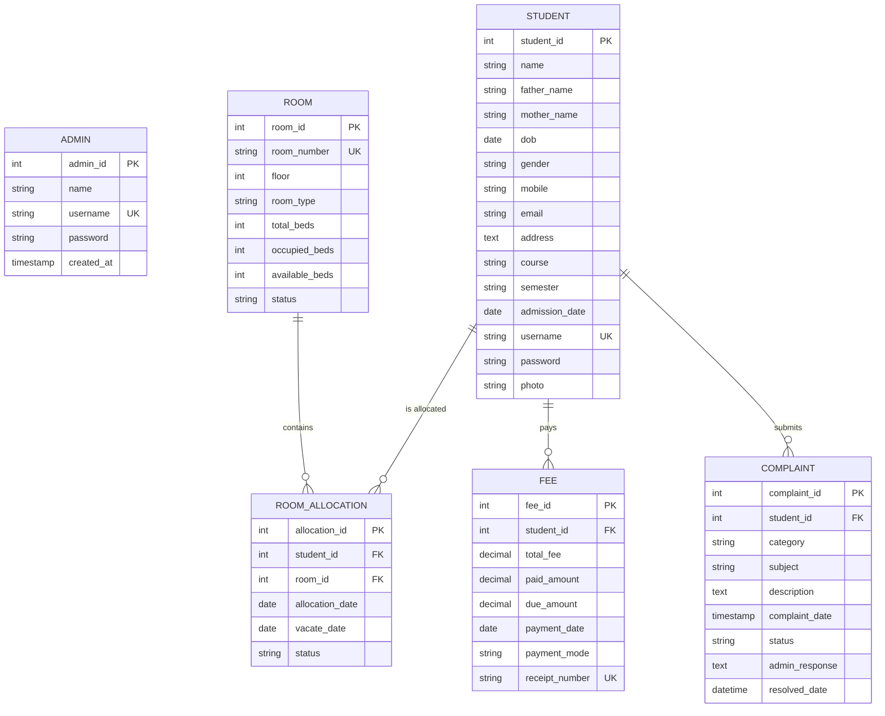

# Project Report: HostelSphere - Hostel Management System

**Academic Degree**: Bachelor of Computer Applications (BCA) / Master of Computer Applications (MCA)  
**Project Category**: Web Application Development  
**Technology Stack**: Java (JSP, Servlets, JDBC), MySQL Database, Apache Tomcat, HTML5, CSS3, Bootstrap 5, JavaScript, Chart.js, DataTables, SweetAlert2  
**Database Name**: `hostel_shivv`  

---

## 1. Project Abstract & Objectives

### 1.1 Abstract
Traditional hostel record-keeping relying on physical register ledgers or unlinked spreadsheets suffers from significant operational drawbacks, including data redundancy, human computational errors during bed allotment, lost complaint tickets, and cumbersome manual fee tracking. 

**HostelSphere** is a centralized, role-based Web-based Hostel Management System engineered using an enterprise **Model-View-Controller (MVC)** architectural paradigm in Java. The application securely separates administrative control from student resident self-service. Administrators can manage student admissions, monitor live bed availability across floors, allocate and transfer rooms using ACID-compliant database transactions, collect fee installments with automated balance calculation, and respond to maintenance grievances. Resident students can access their allocated room details, review payment history, generate printable fee receipts, and track submitted maintenance requests in real time.

### 1.2 Core Objectives
- **Centralized Data Storage**: Maintain a single source of truth in MySQL (`hostel_shivv`) for all resident, room, billing, and support records.
- **Accurate Capacity Management**: Eliminate room oversubscription by dynamically updating available beds through atomic database transactions:
  $$\text{Available Beds} = \text{Total Beds} - \text{Occupied Beds}$$
- **Automated Fee Accounting**: Instantly compute pending balances upon payment entry:
  $$\text{Due Amount} = \text{Total Fee} - \text{Paid Amount}$$
- **Transparent Grievance Redressal**: Implement an auditable ticketing system categorizing complaints into Room, Electricity, Water, Mess, Cleaning, Maintenance, and Other issues.
- **Security & Authorization**: Enforce strict session validation preventing unauthorized URL-tampering between student and administrator pages.

---

## 2. System Analysis & Feasibility Study

### 2.1 Existing System vs. Proposed System

| Parameter | Traditional Manual System | HostelSphere Digital System |
| :--- | :--- | :--- |
| **Record Storage** | Paper logbooks, ledger cards | Normalized relational database (`hostel_shivv`) |
| **Allocation Speed** | High latency; prone to double allotment | Instant verification & transactional lock |
| **Fee Tracking** | Manual calculations; misplaced receipts | Automatic due calculation & print-ready receipts |
| **Grievance Handling** | Verbal/written notes; no tracking | Status tracked (Pending $\rightarrow$ In Progress $\rightarrow$ Resolved) |
| **Data Integrity** | Vulnerable to loss, damage, tampering | Password encryption, relational foreign keys, backups |

### 2.2 Feasibility Study
1. **Technical Feasibility**: Built on industry-standard open-source technologies (Java Servlets, JSP, JDBC, MySQL, Tomcat) with high portability across Windows, Linux, and macOS.
2. **Economic Feasibility**: Open-source runtime (XAMPP, Apache Tomcat, MySQL) requires zero licensing costs.
3. **Operational Feasibility**: Intuitive Bootstrap 5 user interface tailored with minimal learning curve for both campus wardens and students.

---

## 3. System Requirements Specification

### 3.1 Hardware Requirements
- **Processor**: Intel Core i3 / AMD Ryzen 3 or higher
- **RAM**: 4 GB minimum (8 GB recommended for concurrent IDE and Tomcat execution)
- **Disk Space**: 500 MB free hard drive space for runtime, libraries, and database logs

### 3.2 Software Requirements
- **Operating System**: Windows 10 / 11, Linux (Ubuntu/Debian), or macOS
- **JDK (Java Development Kit)**: Version 8, 11, 17, 21, or 26
- **Web Server**: Apache Tomcat 8.5 / 9.0 / 10.x
- **Database Server**: MySQL 5.7+ / MySQL 8.x / MariaDB (via XAMPP)
- **Database Management Client**: phpMyAdmin or MySQL Workbench
- **Web Browser**: Chrome, Firefox, Edge, or Safari with JavaScript enabled

---

## 4. Software Architecture & Design

### 4.1 MVC Architecture
The system strictly adopts the **Model-View-Controller (MVC)** architectural design pattern:

```
+-------------------------------------------------------------------+
|                        Client Web Browser                         |
|     (HTML5 / CSS3 / Bootstrap 5 / JavaScript / Chart.js)          |
+-------------------------------------------------------------------+
                                  │  HTTP Request
                                  ▼
+-------------------------------------------------------------------+
|               Controller Layer (Java Servlets)                    |
|   - LoginServlet / LogoutServlet                                  |
|   - StudentServlet (CRUD, Admissions)                             |
|   - RoomServlet (Room Inventory, Beds)                            |
|   - AllocationServlet (Atomic Allocations & Vacate)               |
|   - FeeServlet (Payment Recording & Ledgers)                      |
|   - ComplaintServlet (Ticketing & Warden Responses)               |
|   - ReceiptServlet (Printable Invoices)                           |
+-------------------------------------------------------------------+
             │                                        ▲
             │ Uses Models                            │ Forwards Data
             ▼                                        │
+-------------------------+             +---------------------------+
|      Model Layer        |             |        View Layer         |
|  - Admin.java           |             |   (JSP Views & Includes)  |
|  - Student.java         |             |  - index.jsp              |
|  - Room.java            |             |  - admin/*.jsp            |
|  - Allocation.java      |             |  - student/*.jsp          |
|  - Fee.java             |             |  - includes/              |
|  - Complaint.java       |             +---------------------------+
+-------------------------+
             │
             ▼
+-------------------------------------------------------------------+
|                   Data Access Layer (DAO)                         |
|   - AdminDAO, StudentDAO, RoomDAO, AllocationDAO, FeeDAO, ...     |
|   - PreparedStatement execution, Parameterized Queries            |
|   - Atomic Transaction Handling (setAutoCommit / commit / rollback)|
+-------------------------------------------------------------------+
                                  │
                                  ▼
+-------------------------------------------------------------------+
|             Relational Database Engine (MySQL: hostel_shivv)      |
|   - admins, students, rooms, room_allocations, fees, complaints   |
+-------------------------------------------------------------------+
```

---

## 5. Entity-Relationship (ER) Diagram

### 5.1 Entities and Attributes
1. **ADMIN** (`admin_id` [PK], `name`, `username`, `password`, `created_at`)
2. **STUDENT** (`student_id` [PK], `name`, `father_name`, `mother_name`, `dob`, `gender`, `mobile`, `email`, `address`, `course`, `semester`, `admission_date`, `username`, `password`, `photo`, `created_at`)
3. **ROOM** (`room_id` [PK], `room_number` [UQ], `floor`, `room_type`, `total_beds`, `occupied_beds`, `available_beds`, `status`, `created_at`)
4. **ROOM_ALLOCATION** (`allocation_id` [PK], `student_id` [FK], `room_id` [FK], `allocation_date`, `vacate_date`, `status`, `created_at`)
5. **FEE** (`fee_id` [PK], `student_id` [FK], `total_fee`, `paid_amount`, `due_amount`, `payment_date`, `payment_mode`, `receipt_number` [UQ], `created_at`)
6. **COMPLAINT** (`complaint_id` [PK], `student_id` [FK], `category`, `subject`, `description`, `complaint_date`, `status`, `admin_response`, `resolved_date`)

### 5.2 Mermaid ER Diagram



---

## 6. Data Flow Diagrams (DFD)

### 6.1 DFD Level 0 (Context Diagram)

```
                     ┌──────────────────────────────────┐
                     │          ADMINISTRATOR           │
                     └──────────────────────────────────┘
                         │ Credentials,       ▲ Dashboard Stats,
                         │ Student Profiles,  │ Reports,
                         │ Rooms, Dues        │ Complaint Feeds
                         ▼                    │
             ╔══════════════════════════════════════════════╗
             ║                                              ║
             ║      0.0 HOSTEL MANAGEMENT SYSTEM            ║
             ║               (HostelSphere)                 ║
             ║                                              ║
             ╚══════════════════════════════════════════════╝
                         ▲                    │
                         │ Credentials,       │ Room Status,
                         │ Grievance Tickets  │ Invoices / Receipts,
                         │                    │ Warden Responses
                         │                    ▼
                     ┌──────────────────────────────────┐
                     │         RESIDENT STUDENT         │
                     └──────────────────────────────────┘
```

### 6.2 DFD Level 1 (Decomposition Diagram)

```
[Users: Admin / Student]
         │
         ▼
 (1.0 Authentication & Session Management) ───► [Database: admins / students]
         │
         ├───► (2.0 Student Profile Management) ───► [Database: students]
         │
         ├───► (3.0 Room & Inventory Management) ──► [Database: rooms]
         │
         ├───► (4.0 Bed Allocation Engine) ───────► [Database: room_allocations & rooms]
         │        (Transactional bed decrement / increment)
         │
         ├───► (5.0 Fee Billing & Receipt Engine) ─► [Database: fees]
         │        (Live Due = Total - Paid)
         │
         └───► (6.0 Complaint & Ticketing Desk) ──► [Database: complaints]
                  (Pending -> In Progress -> Resolved)
```

---

## 7. Database Table Specifications (Data Dictionary)

### 7.1 Table: `admins`
| Field | Data Type | Nullable | Key | Description |
| :--- | :--- | :--- | :--- | :--- |
| `admin_id` | INT | No | PK, AI | Unique administrator ID |
| `name` | VARCHAR(100) | No | | Full name of admin / warden |
| `username` | VARCHAR(50) | No | UNIQUE | Login username |
| `password` | VARCHAR(255) | No | | Password string (plain/SHA-256) |
| `created_at`| TIMESTAMP | No | | Timestamp of creation |

### 7.2 Table: `students`
| Field | Data Type | Nullable | Key | Description |
| :--- | :--- | :--- | :--- | :--- |
| `student_id` | INT | No | PK, AI | Unique Student Roll ID |
| `name` | VARCHAR(100) | No | | Student full name |
| `father_name`| VARCHAR(100) | No | | Father's name |
| `mother_name`| VARCHAR(100) | No | | Mother's name |
| `dob` | DATE | No | | Date of birth |
| `gender` | VARCHAR(10) | No | | Gender (Male/Female/Other) |
| `mobile` | VARCHAR(20) | No | | 10-digit mobile number |
| `email` | VARCHAR(100) | No | | Active email address |
| `address` | TEXT | No | | Permanent postal address |
| `course` | VARCHAR(50) | No | | Enrolled course (BCA/MCA/etc.) |
| `semester` | VARCHAR(20) | No | | Current semester |
| `admission_date` | DATE | No | | Hostel admission date |
| `username` | VARCHAR(50) | No | UNIQUE | Portal login ID |
| `password` | VARCHAR(255) | No | | Portal login password |
| `photo` | VARCHAR(255) | Yes | | Avatar filename |

### 7.3 Table: `rooms`
| Field | Data Type | Nullable | Key | Description |
| :--- | :--- | :--- | :--- | :--- |
| `room_id` | INT | No | PK, AI | Internal Room ID |
| `room_number`| VARCHAR(20) | No | UNIQUE | Room number string (e.g. 101, 202) |
| `floor` | INT | No | | Floor number |
| `room_type` | VARCHAR(50) | No | | Single/Double/Triple Sharing |
| `total_beds` | INT | No | | Total capacity |
| `occupied_beds`| INT | No | | Currently occupied beds |
| `available_beds`| INT | No | | Vacant beds |
| `status` | VARCHAR(20) | No | | Available / Occupied |

### 7.4 Table: `room_allocations`
| Field | Data Type | Nullable | Key | Description |
| :--- | :--- | :--- | :--- | :--- |
| `allocation_id` | INT | No | PK, AI | Unique allocation transaction ID |
| `student_id` | INT | No | FK | Reference to `students.student_id` |
| `room_id` | INT | No | FK | Reference to `rooms.room_id` |
| `allocation_date` | DATE | No | | Date of occupancy |
| `vacate_date` | DATE | Yes | | Date student checked out |
| `status` | VARCHAR(20) | No | | Active / Vacated |

### 7.5 Table: `fees`
| Field | Data Type | Nullable | Key | Description |
| :--- | :--- | :--- | :--- | :--- |
| `fee_id` | INT | No | PK, AI | Fee record ID |
| `student_id` | INT | No | FK | Reference to `students.student_id` |
| `total_fee` | DECIMAL(10,2)| No | | Assessed fee |
| `paid_amount`| DECIMAL(10,2)| No | | Paid installment |
| `due_amount` | DECIMAL(10,2)| No | | Balance pending due |
| `payment_date` | DATE | No | | Date of transaction |
| `payment_mode` | VARCHAR(30) | No | | Cash / UPI / Bank Transfer |
| `receipt_number` | VARCHAR(50) | No | UNIQUE | Official receipt code |

### 7.6 Table: `complaints`
| Field | Data Type | Nullable | Key | Description |
| :--- | :--- | :--- | :--- | :--- |
| `complaint_id` | INT | No | PK, AI | Grievance ticket number |
| `student_id` | INT | No | FK | Reference to `students.student_id` |
| `category` | VARCHAR(50) | No | | Issue category |
| `subject` | VARCHAR(150)| No | | Issue title |
| `description` | TEXT | No | | Detailed problem description |
| `complaint_date` | TIMESTAMP | No | | Time of submission |
| `status` | VARCHAR(20) | No | | Pending / In Progress / Resolved / Rejected |
| `admin_response` | TEXT | Yes | | Warden's resolution note |
| `resolved_date` | DATETIME | Yes | | Timestamp of closure |

---

## 8. Functional Modules & Business Logic

### 8.1 Dual Authentication & Role Guard
- Two distinct authorization tiers (**Admin** and **Student**).
- Public registration is prohibited; only administrators can enroll students to prevent unauthorized campus residency.
- Every protected JSP checks the session:
  ```java
  if (session == null || !"admin".equals(session.getAttribute("userRole"))) {
      response.sendRedirect(request.getContextPath() + "/index.jsp");
      return;
  }
  ```

### 8.2 Room Allocation Capacity Engine
- When an admin selects a student and a vacant room:
  1. Transaction begins (`conn.setAutoCommit(false)`).
  2. Ensures the student has no other active room (`status = 'Active'`).
  3. Locks room record via `SELECT ... FOR UPDATE`.
  4. Inserts row in `room_allocations`.
  5. Updates room counters atomically:
     $$\text{Occupied Beds} = \text{Occupied Beds} + 1, \quad \text{Available Beds} = \text{Available Beds} - 1$$
  6. If `Available Beds == 0`, marks status as `'Occupied'`.
  7. Commits transaction (`conn.commit()`).
- When vacating a room:
  1. Sets allocation `status = 'Vacated'` and records `vacate_date`.
  2. Increments `Available Beds` by 1 and decrements `Occupied Beds` by 1.
  3. Sets room status back to `'Available'`.

### 8.3 Fee Accounting & Printable Tax Slips
- Computes pending balance dynamically upon entry:
  $$\text{Due} = \text{Total Fee} - \text{Paid Amount}$$
- Generates a unique, standardized receipt number:
  $$\text{REC-yyyyMMdd-XXXX}$$
- Generates a printable CSS-optimized invoice containing the hostel seal, transaction stamp, watermark, and authorized signature.

### 8.4 Grievance Desk Workflow
- **Student Submission**: Student picks from preset categories (Room, Electricity, Water, Food/Mess, Cleaning, Maintenance, Other), enters a subject and description. The ticket status defaults to `'Pending'`.
- **Warden Review & Status Update**: The administrator inspects the complaint, assigns maintenance staff, updates the status to `'In Progress'`, and appends an official response.
- **Resolution**: Upon repair completion, the administrator updates the status to `'Resolved'`, which automatically stamps the `resolved_date`. The student immediately observes the feedback in their portal.

---

## 9. Project Advantages, Limitations & Future Scope

### 9.1 Advantages
- **Zero Room Oversubscription**: Capacity constraints prevent assigning students to rooms with no vacant beds.
- **Elimination of Data Redundancy**: Normalized schema with foreign key cascades prevents orphaned records.
- **Enhanced Accountability**: Every fee installment and complaint response has a documented timestamp and ID.
- **Printable Invoices**: Native browser print stylesheet generates standardized physical fee vouchers.
- **Responsive Modern UI**: Built with Bootstrap 5, Font Awesome, and Chart.js for seamless desktop, tablet, and mobile responsiveness.

### 9.2 Limitations
- Offline payment recording (payment gateway API integration such as Razorpay / Stripe is simulated with Cash/UPI/Bank transfer modes).
- SMS gateway integration for automated parental notification requires a paid telecommunication API subscription.

### 9.3 Future Scope
- **Online Payment Gateway**: Integration with Razorpay, Stripe, or Paytm for direct online net-banking fee settlements.
- **Biometric / QR Code Gate Attendance**: RFID / biometric student entry and exit tracking at hostel gates.
- **Mess Menu & Meal Booking**: Daily mess meal selection, caloric tracking, and rebate calculation during vacations.
- **Hostel Notice Board Broadcasts**: Push notification and email broadcasts for curfew and inspection notices.
